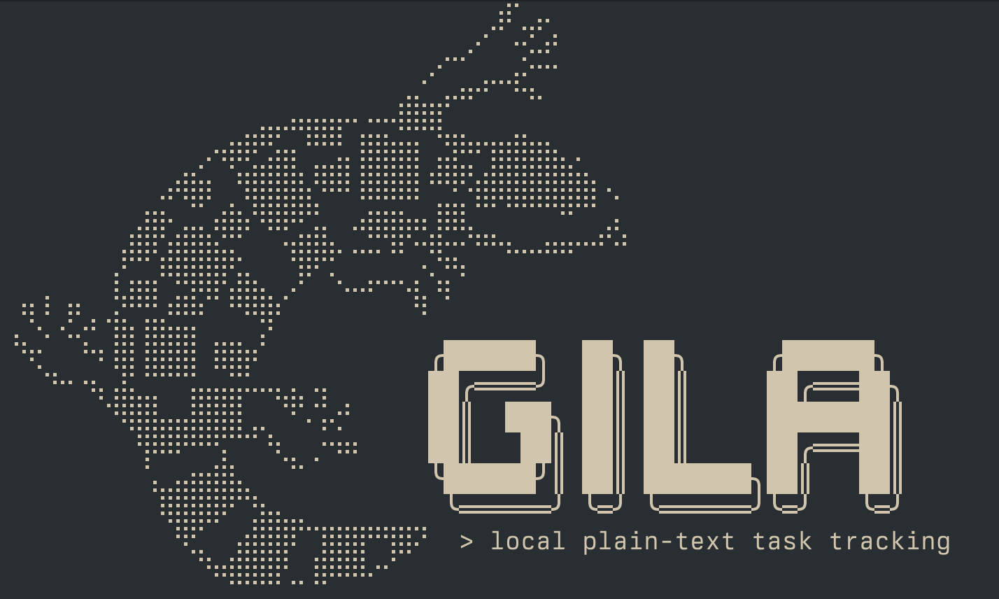

<figure style="margin:0;">
    
</figure>

> 🚧 **Heads up:** GILA is currently in active development. Things might break, commands might change, and the lizard might bite.

## What is GILA?

**GILA** is a specificationf for a local task tracker meant to be used for small hobby projects.

It keeps your tasks as plain text files right inside your repo (in a handy `.gila/` folder). It's built to be human-readable, version-control friendly, and portable.

Heavily inspired by the task system used by [Tsoding](https://www.youtube.com/@Tsoding).

## Why?

Because `TODO` comments get lost, and I dont like JIRA for something like my recreational projects.

* The tasks live where your code lives. Syncing your repo syncs your tasks.
* Each task is just a Markdown file with simple frontmatter. Readable everywhere.
* Tasks get timestamp-based IDs (`YYYYMMDD_HHMMSS_username`) so you can reference them anywhere.
* Since it's just files, you can script it, grep it, or edit it with neovim(btw).

## Visuals

Since GILA uses standard YAML frontmatter, your tasks look great in tools that understand metadata.

<div style="display:flex; gap:12px; flex-wrap:wrap; align-items:flex-start;">
  <figure style="margin:0;">
    
    <figcaption style="font-size:0.9em; color: #888;"><i>GitHub rendering the frontmatter as a table.</i></figcaption>
  </figure>
  <figure style="margin:0;">
    
    <figcaption style="font-size:0.9em; color: #888;"><i>Obsidian Properties view.</i></figcaption>
  </figure>
</div>

<br>

<figure style="margin:0;">
  
  <figcaption style="font-size:0.9em; color: #888;"><i>You can even build a full dashboard in Obsidian.</i></figcaption>
</figure>

## Quick Start

You'll need [Zig](https://ziglang.org/download/) installed.

1.  **Build it:**
    ```bash
    zig build -Doptimize=ReleaseSafe
    ```
2.  **Run it:**
    Add `zig-out/bin` to your PATH, or just run:
    ```bash
    ./zig-out/bin/gila init
    ```

<section>
  <h2>Spec essentials</h2>
  <ul>
    <li>Tasks live under <code>.gila/</code> with folders named by status (e.g. <code>todo/</code>, <code>done/</code>).</li>
    <li>Each task has an ID <code>YYYYMMDD_HHMMSS_username</code> (see <a href="SPEC.md#taskid">SPEC.md#taskid</a>) and a matching <code>task_id.md</code> file as source of truth.</li>
    <li>Status and priority are lowercase: <code>todo|done|in_progress|cancelled|waiting</code>; <code>low|medium|high|urgent</code>.</li>
    <li>If folder and file disagree, the header in the file wins.</li>
    <li>Header structure follows <a href="SPEC.md#task-description">SPEC.md#task-description</a>.</li>
  </ul>
</section>

## Commands

Here is how you drive the lizard:

```
gila [-h | --help]
gila version
gila init [-h | --help] [--bare] [<directory>]
gila todo [--priority=low|medium|high|urgent] [--priority-value=<integer value>;] \
          [--description=<description>;] [--tags="<tag1>,<tag2>,..."] [--verbose] \
          [--edit] <title>
gila done [-h | --help] [--verbose] [--edit] <task_id>
```

| Command | Description |
| :--- | :--- |
| `gila init` | Sets up a new GILA project in the current directory |
| `gila todo` | Creates a new task in the current project |
| `gila done` | Mark a task as done and moves it to the `done` folder |
| `gila version` | Prints the version |

### Examples

**Start a project:**
```bash
gila init
```

**Create a task**
```bash
# Basic
gila todo "Fix the memory leak in the renderer"

# More customizable and opens the file in your editor at $EDITOR or vim by default
gila todo --priority=high --priority-value=80 --tags="bug,renderer" --edit "Fix the memory leak"
# > New task created: 20251213_084840_adiraj
```

**Finish the task**
```bash
# Marks the task as done and opens the editor at $EDITOR or vim by default
gila done --edit 20251213_084840_adiraj
```
**Example task file**
```markdown
---
title: Flesh out test runner and maybe move to stdx
status: todo
priority: medium
priority_value: 50
owner: adiraj
created: 2025-12-13T18:43:34Z
tags:
- testing
- stdx
---

The custom test runner is currently a very barebones implementation. It should be able to run all the tests
similar to the default test runner but we can define globals and such that exist in the `@import("root")` struct.

Maybe this needs to live in the stdx library as a template? I am not sure how to achieve this.
Maybe i can write the test runner main in stdx and you can write your own test runner and just set
```
