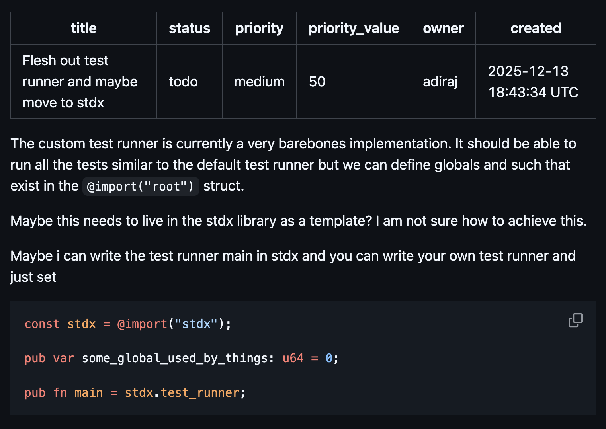
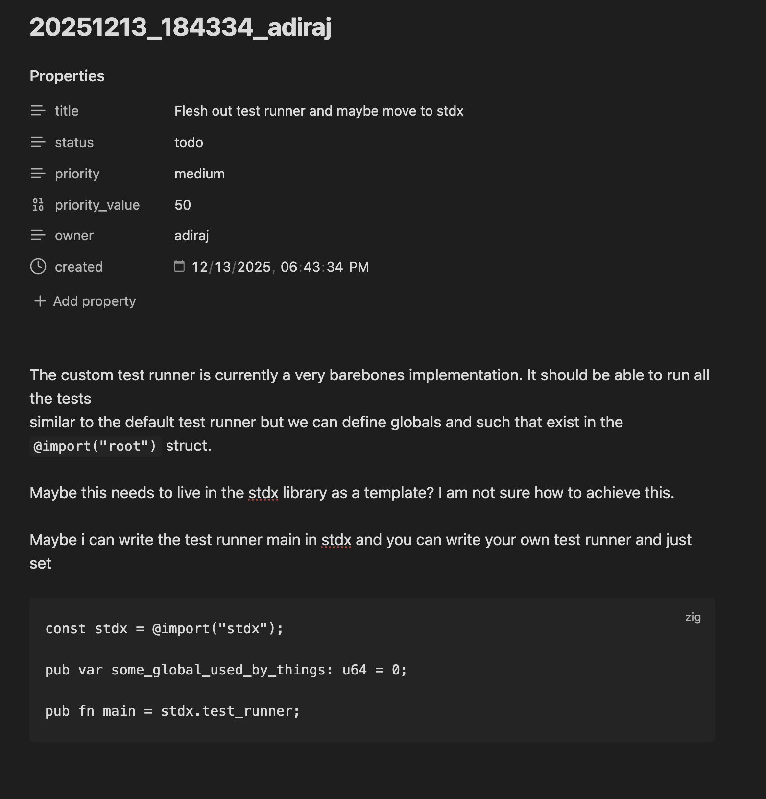
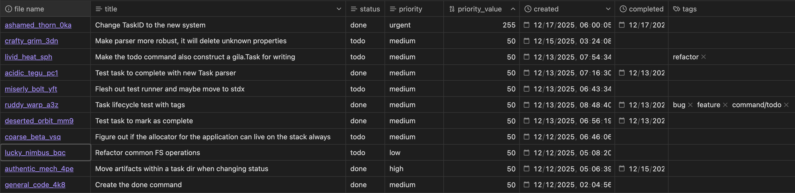

<pre style="font-family: 'SFMono-Regular', Menlo, Consolas, 'Liberation Mono', monospace; font-variant-ligatures: none; line-height:1; letter-spacing:0.02em; margin:0; padding:0; white-space:pre;">
⠀⠀⠀⠀⠀⠀⠀⠀⠀⠀⠀⠀⠀⠀⠀⠀⠀⠀⠀⠀⠀⠀⠀⠀⠀⠀⠀⠀⠀⠀⠀⣰⠏⣀⡤⠀⠀⠀⠀⠀
⠀⠀⠀⠀⠀⠀⠀⠀⠀⠀⠀⠀⠀⠀⠀⠀⠀⠀⠀⠀⠀⠀⠀⠀⠀⠀⠀ ⣀⡠⠊⠀⠐⡪⠴⠃⠀⠀⠀⠀
⠀⠀⠀⠀⠀⠀⠀⠀⠀⠀⠀⠀⠀⠀⠀⠀⠀⠀⠀⠀⠀⠀⠀⠀⠀⠀⠠⠊⠀⣀⣠⠤⢴⣊⠉⠁⠀⠀⠀⠀
⠀⠀⠀⠀⠀⠀⠀⠀⠀⠀⠀⠀⠀⠀⠀⠀⠀⠀⣀⣀⣀⣀⡀⣀⣀⣾⣷⣶⠋⠉⠀⠀⠀⠈⠁⠀⠀⠀⠀⠀
⠀⠀⠀⠀⠀⠀⠀⠀⠀⠀⠀⠀⠀⣀⣤⣶⠿⣋⡉⠿⠿⠇⢰⣶⣦⣭⡍⠙⢶⣦⡤⣤⣴⣦⣤⡀⠀⠀⠀⠀
⠀⠀⠀⠀⠀⠀⠀⠀⠀⠀⢀⣤⣊⠈⢫⣵⣾⣿⣧⢰⣶⣿⢸⣿⣿⣿⡇⣼⣿⡶⣠⣿⣿⣿⣿⣿⣮⣄⠀⠀
⠀⠀⠀⠀⠀⠀⠀⠀⢀⣐⠋⠻⠟⢀⣄⢻⣿⣿⣿⣧⠉⠉⠘⣛⣛⡛⠃⢠⣬⡌⠿⠟⠿⠿⠿⢿⡿⠿⠈⠂
⠀⠀⠀⠀⠀⠀⠀⢠⣾⡿⣡⣶⣦⡻⠿⠃⠙⢛⣩⣴⣆⠀⠚⠿⢿⡿⣛⣼⣛⡳⣤⣄⡀⠀⢀⣀⣀⣀⡴⣣
⠀⠀⠀⠀⠀⠀⢀⠟⠛⢱⣿⣿⣿⣿⢗⡀⠀⠀⢻⡿⢛⠁⠉⠉⠈⠁⠠⡙⠶⡄⠀⠀⠉⠉⠉⠉⠁⠀⠀⠀
⢀⡀⡄⢀⡀⠀⠸⣼⣿⡇⣨⣽⡻⠏⣾⣿⣦⡠⠊⠀⠀⠑⠒⠋⠉⠑⣧⠘⠇⠀⠀⠀⠀⠀⠀⠀⠀⠀⠀⠀
⡈⠣⡁⢜⡡⠆⢺⣦⢰⣶⣭⣭⠁⠀⠀⠉⡻⠁⠀⠀⠀⠀⠀⠀⠀⠀⠈⠀⠀⠀⠀⠀⠀⠀⠀⠀⠀⠀⠀⠀
⠙⢖⠀⠀⠘⠲⢸⣿⢸⣿⣿⣿⠀⣿⣿⡶⠁⠀⠀⠀⠀⠀⠀    ╭██████╮  ██╮ ██╮     ╭██████╮ 
⠀⠀⠙⠒⠐⢦⢠⣯⣈⡉⠉⢩⣤⣤⣭⠥⠤⣄⣄⠠⡄⠀⠀⠀⠀⠀⠀██╭════╯  ██║ ██║     ██╭═══██╮
⠀⠀⠀⠀⠀⠀⠙⢿⣿⣧⣤⣼⣿⣿⣿⢀⡀⠈⠋⠌⡥⡚⠀⠀⠀⠀⠀██║  ███╮ ██║ ██║     ████████║
⠀⠀⠀⠀⠀⠀⠀⠀⢻⠿⠿⠛⠛⢫⠉⠉⠘⢆⡀⢀⠒⠶⠆⠀⠀⠀⠀██║   ██║ ██║ ██║     ██╭═══██║
⠀⠀⠀⠀⠀⠀⠀⠀⠈⣄⣠⣴⣶⣿⣧⡀⠀⠀⠉⠀⠀⠀⠀⠀⠀⠀ ╰██████╯║ ██║ ███████╮██║   ██║
⠀⠀⠀⠀⠀⠀⠀⠀⠀⠸⣿⣿⣿⡿⠋⢙⣦⣄⣀⠀⠀⠀⠀⠀⠀⠀⠀ ╰══════╯ ╰═╯ ╰══════╯╰═╯   ╰═╯
⠀⠀⠀⠀⠀⠀⠀⠀⠀⠀⠘⢟⡁⠀⢠⣾⣿⣿⠏⠉⣿⣿⣿⠛⢻⣿⠝⠀⠀> local plain-text task tracking
⠀⠀⠀⠀⠀⠀⠀⠀⠀⠀⠀⠀⠙⠶⣿⣿⣿⡟⣀⢸⡿⠿⠿⠔⠊⠀⠀⠀⠀⠀⠀⠀⠀⠀⠀⠀⠀⠀⠀
⠀⠀⠀⠀⠀⠀⠀⠀⠀⠀⠀⠀⠀⠀     ⠀⠀⠀⠀⠀⠀⠀⠀⠀⠀⠀⠀⠀⠀⠀⠀⠀
</pre>

> **Warning:** GILA and this CLI are under active development. Expect breaking changes and rough edges while the spec and implementation stabilize.

<section>
  <h2>Introduction</h2>
  
GILA is a specification for local plain-text task tracking. The CLI here reads and manages those tasks as a reference implementation. The full spec lives in <a href="SPEC.md">SPEC.md</a>.

  
Tasks stay as plain text under <code>.gila/</code>, so they remain human-readable, versionable, and portable. Any tool can consume the format defined in the spec.

  

    <figure style="margin:0;">
      
      <figcaption style="font-size:0.9em;">GitHub renders the frontmatter as a metadata table.</figcaption>
    </figure>
    <figure style="margin:0;">
      
      <figcaption style="font-size:0.9em;">Obsidian shows the same frontmatter as Properties.</figcaption>
    </figure>
  

</section>

<section>
  <h3>Features</h3>
  <ul>
    <li>Local plain-text storage — never locked-in.</li>
    <li>Task IDs are based on creation timestamp and username (<code>YYYYMMDD_HHMMSS_username</code>).</li>
    <li>Each task is a Markdown file with YAML/Obsidian-style frontmatter for metadata.</li>
    <li>Add tasks with titles, priorities, descriptions, and tags via the CLI or manually.</li>
    <li>Version-control friendly (diffable text, predictable layout).</li>
    <li>Extensible for your own scripts and automations — they’re just files.</li>
  </ul>
</section>

<section>
  <h2>Installation</h2>
  
You need the <a href="https://ziglang.org/download/">Zig compiler</a> on your PATH. Build from source:

  <ol>
    <li><code>zig build</code> to produce <code>zig-out/bin/gila</code>.</li>
    <li>Optionally add it to your PATH, e.g. <code>export PATH="$(pwd)/zig-out/bin:$PATH"</code>.</li>
    <li>Run without installing: <code>zig build run -- &lt;args&gt;</code>.</li>
    <li>Run tests: <code>zig build test</code>.</li>
  </ol>
</section>

<section>
  <h2>Spec essentials</h2>
  <ul>
    <li>Tasks live under <code>.gila/</code> with folders named by status (e.g. <code>todo/</code>, <code>done/</code>).</li>
    <li>Each task has an ID <code>YYYYMMDD_HHMMSS_username</code> (see <a href="SPEC.md#taskid">SPEC.md#taskid</a>) and a matching <code>task_id.md</code> file as source of truth.</li>
    <li>Status and priority are lowercase: <code>todo|done|in_progress|cancelled|waiting</code>; <code>low|medium|high|urgent</code>.</li>
    <li>If folder and file disagree, the header in the file wins.</li>
    <li>Header structure follows <a href="SPEC.md#task-description">SPEC.md#task-description</a>.</li>
  </ul>
</section>

<section>
  <h2>CLI usage</h2>
  <h3>Basic usage</h3>
  <pre><code>gila [-h | --help]
gila version
gila init [-h | --help] [--bare] [<directory>]
gila todo [--priority=low|medium|high|urgent] [--priority-value=&lt;integer value&gt;] \
          [--description=&lt;description&gt;] [--tags="&lt;tag1&gt;,&lt;tag2&gt;,..."] [--verbose] \
          [--edit] &lt;title&gt;
gila done [-h | --help] [--verbose] [--edit] &lt;task_id&gt;</code></pre>

  <h3>Commands</h3>
  <table>
    <thead>
      <tr><th>Command</th><th>Summary</th></tr>
    </thead>
    <tbody>
      <tr><td><code>version</code></td><td>Prints the GILA CLI version.</td></tr>
      <tr><td><code>init</code></td><td>Initializes a GILA project in the current or specified directory.</td></tr>
      <tr><td><code>todo</code></td><td>Creates a new task in the project.</td></tr>
      <tr><td><code>done</code></td><td>Moves a task to <code>done</code> and marks status as done.</td></tr>
      <tr><td><code>tag</code></td><td>Adds tags to a task (coming soon).</td></tr>
    </tbody>
  </table>

  <h3>Options</h3>
  <ul>
    <li><code>-h</code>, <code>--help</code>: Prints help.</li>
    <li>Other options are command-specific (see examples).</li>
  </ul>

  <h3>Examples</h3>
  <pre><code>gila init
gila todo --priority=low --priority-value=50 --description="This is a description" 'Title of the task'
gila done 20251213_084840_adiraj</code></pre>
</section>

<section>
  <h2>Example task files (frontmatter as properties)</h2>
  
GitHub renders YAML frontmatter as a metadata table; Obsidian reads it as Properties. Dataview/DB-style views also work well:

  <figure style="margin:0;">
    
    <figcaption style="font-size:0.9em;">Obsidian Dataview-style table built directly from task frontmatter.</figcaption>
  </figure>

  <h3>Todo example (mirrors <code>.gila/todo/20251213_184334_adiraj/20251213_184334_adiraj.md</code>)</h3>
  <pre><code>---
title: Flesh out test runner and maybe move to stdx
status: todo
priority: medium
priority_value: 50
owner: adiraj
created: 2025-12-13T18:43:34Z
tags:
- testing
- stdx
---

The custom test runner is currently a very barebones implementation. It should be able to run all the tests
similar to the default test runner but we can define globals and such that exist in the `@import("root")` struct.

Maybe this needs to live in the stdx library as a template? I am not sure how to achieve this.

Maybe i can write the test runner main in stdx and you can write your own test runner and just set</code></pre>

  <h3>Done example</h3>
  <pre><code>---
title: Test task to complete with new Task parser
status: done
priority: medium
priority_value: 50
owner: adiraj
created: 2025-12-13T19:16:30Z
completed: 2025-12-13T19:31:26Z
tags:
- parser
- cleanup
---

Resolved init panic caused by missing config; see logs in this folder.</code></pre>
</section>